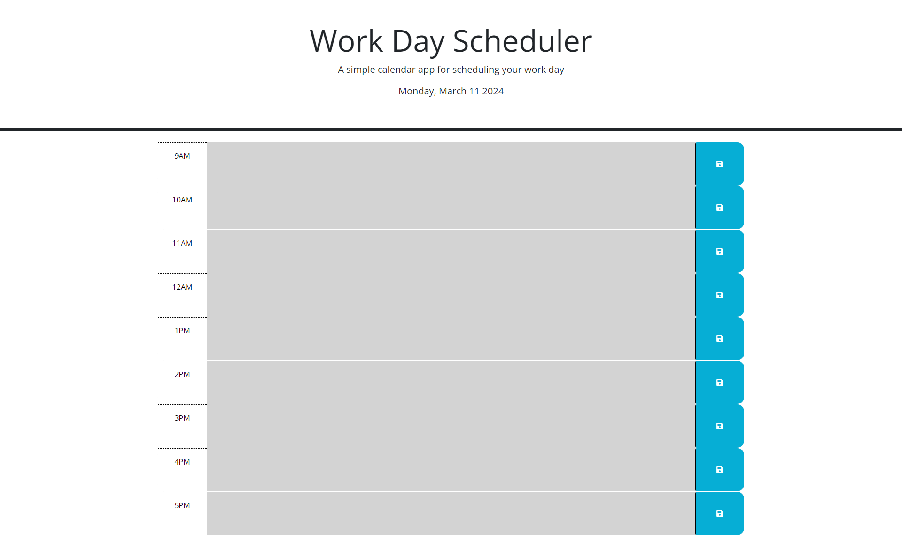

## Work Day Scheduler - 05 Third-Party APIs - challenge

## Description

Create a simple calendar application that allows a user to save events for each hour of a typical working day from 9am-5pm by modifying starter code.

## Work Day Scheduler Site

## Links
